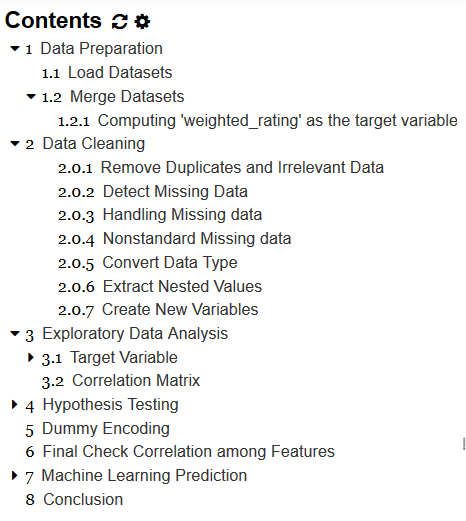

# Project Title: Movie Rating Predictor

## Motivation: 
Movie, as a combination of commercial products and art crafts, have created billionaire film stars and have shaped our feelings over the centuries. Although the success of a movie would glorify all the participants, it also requires tremendous input in terms of budget and team works. Predicting the movie ratings could help the chain of movie business find a golden formula to know how to better plan their movie-making strategy.

## Project Scope:
In this project, I first examined what features could effectively influence the audience’s preference with EDA. Features being investigated included genres, release years, budgets, production companies, top casts and titles. I built decision tree regressor and random forest regressor to predict the movie rating.

### Dataset:
The data sets being used are from TMDB and GroupLens. It covers 45,000 movies, released before or on 2017, and contain 26 million ratings from 270,000 users. 

### Project Structure:
Data Manipulation
Exploratory analysis
Predictor modeling

## Links

[Discussion about process](https://docs.google.com/document/d/1JCbUu9TrqDHDuz_BJtEVqMC1MJiGdhtbr3fyU9QkxhE/)

### Jupyter start notebook

```
jupyter notebook --no-browser
```

### Jupyter notebook extensions

1. Install Jupyter [notebook extensions](https://jupyter-contrib-nbextensions.readthedocs.io/en/latest/)

The *Table of Contents* extension called TOC2 displays the following table.




